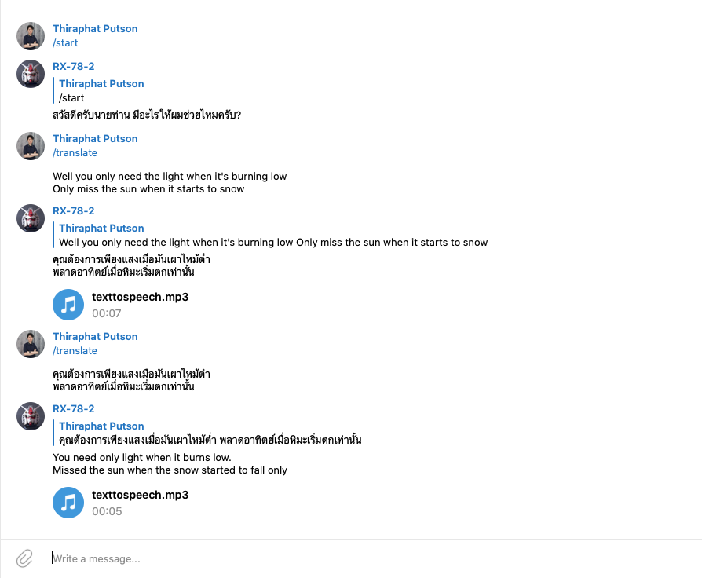

# telegram_bot_rx-78-2

## Preview


## Installation
create venv with command
```bash
$ python3 -m venv ./venv
```
activate
```bash
$ source venv/bin/activate
```

install requirements.txt
```bash
$ pip install -r requirements.txt
```

run file
```bash
$ python clock.py
```

##Thank!